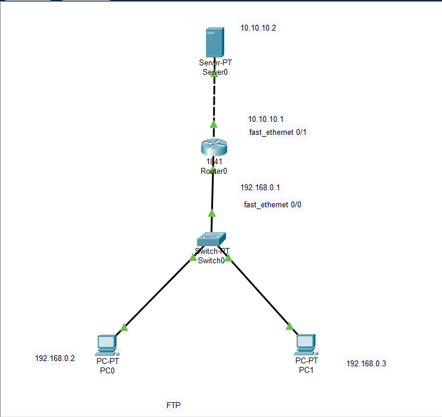

# **FTP Configuration Steps in Cisco Packet Tracer**



## **Download Network Topology Packet Tracer File**

[Download .pkt file](./pkt/ftp.pkt)

## **Network Setup**

1. **Components Needed:**
   - 1 Server
   - 1 Router (1841)
   - 1 Switch (PT)
   - 2 PCs

2. **Connect the Devices:**
   - Connect all devices as shown in the provided diagram.

## **Router Configuration**

3. **Identify Router Connections:**
   - Access the router and check which FastEthernet interfaces are connected to which devices:
     - Use the command: 
       ```bash
       show ip interface brief
       ```
   - There will be two connections:
     - Identify which interface is connected to the server and which is connected to the switch.

4. **Assign IP Addresses:**
   - Assign the following IP addresses:
     - **To the interface connected to the server:** 
       - `10.10.10.1`
     - **To the interface connected to the switch:** 
       - `192.168.0.1`

## **PC Configuration**

5. **Configure PC1:**
   - Assign the IP address:
     - **IP Address:** `192.168.0.2`
     - **Default Gateway:** `192.168.0.1`

6. **Configure PC2:**
   - Assign the IP address:
     - **IP Address:** `192.168.0.3`
     - **Default Gateway:** `192.168.0.1`

## **Server Configuration**

7. **Configure the Server:**
   - Assign the IP address:
     - **IP Address:** `10.10.10.2`
     - **Default Gateway:** `10.10.10.1`

8. **Set Up FTP Service:**
   - Go to **Services** on the server.
   - Navigate to **FTP** and set the following:
     - **Username:** `cisco1`
     - **Password:** `123`
   - Assign permissions:
     - **Read**
     - **Write**
     - **Rename**
     - **List**
   - Click **Add** to save the settings.

## **File Transfer from PC1**

9. **Create a File on PC1:**
   - Go to **Desktop** → **Text Editor**.
   - Create a random file and save it as `.txt` (e.g., `your_file_name.txt`).

10. **Ping the Server:**
    - Open **Command Prompt** on PC1.
    - Type:
      ```bash
      ping 10.10.10.2
      ```
    - If successful, proceed to FTP.

11. **Access FTP:**
    - Type:
     ```bash
      ftp
      ```
      ```bash
      ftp 10.10.10.2
      ```
    - When prompted, enter:
      - **Username:** `cisco1`
      - **Password:** `123`
    - Upload the file:
      ```bash
      put your_file_name.txt
      ```

## **File Transfer to PC2**

12. **Access FTP from PC2:**
    - Open **Command Prompt** on PC2.
    - Type:
      ```bash
      ftp
      ```
      ```bash
      ftp 10.10.10.2
      ```
    - When prompted, enter:
      - **Username:** `cisco1`
      - **Password:** `123`
    - Download the file:
      ```bash
      get your_file_name.txt
      ```

## **Troubleshooting**

- If you encounter an error while pinging the server:
  - Check the router's IP connections to ensure proper configurations.

---

**Done!** Now you have successfully set up FTP and transferred files between PCs.
