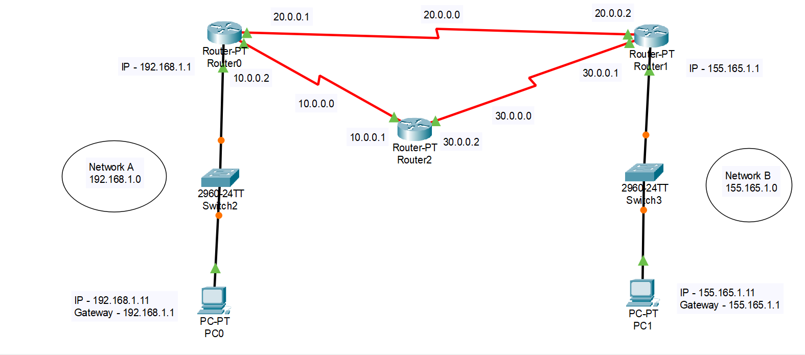

## OSPF
## **Download OSPF Network Topology Packet Tracer File**

[Download OSPF_3_Routers.pkt](./pkt/ospf_3_routers.pkt)




### Network Setup Overview

- **PCs:**

  - **PC1 (Network 1)**:
    - IP: 192.168.1.11
    - Gateway: 192.168.1.1
  - **PC2 (Network 2)**:
    - IP: 155.165.1.11
    - Gateway: 155.165.1.1

- **Routers:**
  - **Router 1 (Connected to Network 1)**:
    - IP: 192.168.1.1
  - **Router 2 (Connected to Network 2)**:
    - IP: 155.165.1.1
  - **Router 3**:
    - Serial connections using IPs from the following networks:
      - **Network A**: 10.0.0.0
      - **Network B**: 20.0.0.0
      - **Network C**: 30.0.0.0

### Step-by-Step Configuration

#### 1. Configure PCs

- **PC1 Configuration:**

  - **IP Address**: 192.168.1.11
  - **Subnet Mask**: 255.255.255.0
  - **Default Gateway**: 192.168.1.1

- **PC2 Configuration:**
  - **IP Address**: 155.165.1.11
  - **Subnet Mask**: 255.255.255.0
  - **Default Gateway**: 155.165.1.1

#### 2. Configure OSPF on Routers

- **Router 1 OSPF Configuration:**

  ```bash
  exit
  router ospf 1
    network 192.168.1.0 0.0.0.255 area 0
    network 10.0.0.0 0.255.255.255 area 0
    network 30.0.0.0 0.255.255.255 area 0
  exit
  ```

- **Router 2 OSPF Configuration:**

  ```bash
  exit
  router ospf 1
    network 155.165.1.0 0.0.0.255 area 0
    network 10.0.0.0 0.255.255.255 area 0
    network 20.0.0.0 0.255.255.255 area 0
  exit
  ```

- **Router 3 OSPF Configuration:**
  ```bash
  exit
  router ospf 1
    network 10.0.0.0 0.255.255.255 area 0
    network 20.0.0.0 0.255.255.255 area 0
    network 30.0.0.0 0.255.255.255 area 0
  exit
  ```

### Testing Connectivity

- After completing the configurations, test connectivity by pinging from PC1 (192.168.1.11) to PC2 (155.165.1.11). If the packets are not able to be sent, ensure that OSPF has propagated the routes correctly between the routers.
